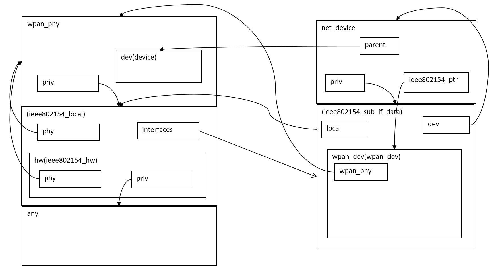

XBeeドライバについて
=====================

about
--------

本稿で使用したXBeeドライバは、本稿の執筆にあわせて
新たに作成したドライバである。
*まだ実験的な水準で安定的に動作はしない* が、
IEEE802.15.4のネットワーク作成を試すことは可能である。

XBeeをLinuxから利用しようとするプロジェクトは
いくつか存在していたが、
いずれも2012年頃に活動が終わっている。

このドライバもそういったプロジェクトの
ソースをベースにして、現行のLinuxのIEEE802.15.4の
実装にあわせて作り直している。

Linux 4.9系列での IEEE802.15.4実装
----------------------------------

LinuxのIEEE802.15.4のデバイスドライバ部分の実装は、
(Linuxのドライバの多くがそうであるように) フレームワークになっており、
デバイス依存の部分の処理を実装して、コールバック関数で登録する。

現行のIEEE802.15.4の場合、デバイス依存部分は
`struct ieee802154_hw` のコールバックを実装することで、
MAC層の処理の共通部分を利用する造りとなっている。
しかしながら、XBeeの場合、デバイスにMAC層の機能があるため、
共通部分の実装は利用できない。
このため、XBeeドライバでは 内部構造である `struct ieee802154_local`
に関連した処理を再実装している。
これに際して、Linuxのネットワークドライバの
共通インターフェースの`struct net_device_ops`
で定義されるコールバックも実装している。
共通部はあるにしても、かなりの部分を再実装している。

`net_device`のドライバ全般としていえることではあるが、
構造体間のポインタの持ち合いが複雑である。

Line discipline
---------------

カーネルドライバからUART通信を行うには、Line disciplineの仕組みを
使う必要がある。
Line descipline はカーネルで認識できる機能種別を番号として
*カーネルコンパイル時に決定する*。

この点で、決定的にモジュールとは相性が悪いのだが、現状、
この定義を動的に追加する方法はない。

XBeeドライバでは、コンパイル時に番号を決められるようにし、
状況に合わせてコンパイルしなおす必要がある。

制限事項など
------------

### Short Addressは使用できない

XBeeには、
*Short Addressが設定されている場合、送信はShort Addressを使って行う*
という仕様がある。

これは、送信側がLong Addressを指定したにもかかわらず
受信側はShort Addressとして受け取ることになる。
つまり、受信側は元々のアドレスがLong AddressだったのかShort Addressだったのか
わからないということが起こる。

このため、少なくとも6LoWPANを使用する場合においては、
Short Address (XBeeでの'MY'のパラメータ)は0xFFFF として、
Long Addressのみで運用する必要がある。

### network namespace は使用できない

MAC層の部分がLinuxカーネルの外にあるため、
MAC層のアドレスを２つ割り付けることができない。
そのためnetwork namespaceによる共用化ができない。

### システム巻き込んでpanicする

まだ、出来上がって間もない段階ですのでご容赦ください。
