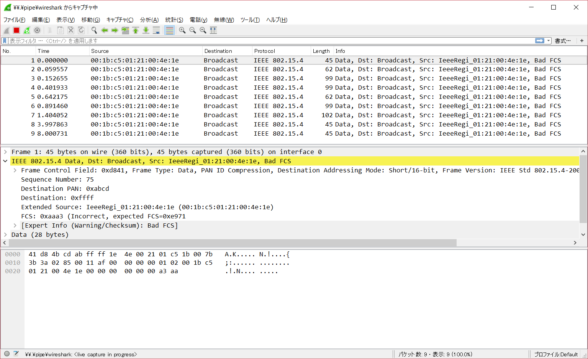

Sniffer
=======

//raw[|latex| \\thispagestyle{empty} ]


パケットを見る
------------------

送信、受信の側がPCであれば、パケット解析ツールのWiresharkを使って
通信のパケットを解析することは比較的簡単だ。

Wiresharkでwpan0のデバイスのキャプチャを行えば、
6LoWPAN(とその上位層)の通信内容を調べることができる。

ノードのマイコン側では、Wiresharkを使うことはできないので、
別のノードを用意して、それをSnifferにして、飛んでいる通信を
「盗聴」する。


sensniff
------------

ContikiOSのソースに含まれている `sensniff` は、
IEEE802.15.4のデバイスが傍受したデータをWiresharkで
見るためのスニファだ。

国内で入手容易なNXPのJN516x(TWE-Lite) や TIのsensertagにも対応している。

```
Node -- (UART) --> sensniff.py -- (named pipe) --> Wireshark
```

PC側からUART経由でNodeが受信したデータを
named pipeを使ってWiresharkに渡すことで、
通信解析を行っている。


ビルド
------

ContikiOSのexampleの一部なので、
各デバイスごとのContikiの環境セットアップを行ったうえで、

TWE-Liteの場合、

```
cd ${CONTIKI}/examples/sensniff
make TARGET=jn516x CHIP=JN5164
```

`sensniff.jn516x.bin` という名前でバイナリが出力される。
これをTWE-Liteに書き込む。

sensniff.py
-----------

ホスト側でsensniff.pyでを立ち上げる。

私家版(Windows対応版)
(https://github.com/soburi/sensniff)[https://github.com/soburi/sensniff]

使用するデバイスとBaudRateと受信チャンネルをコマンドラインから指定する。

```
C:\Python36\python.exe sensniff.py -d COM10 -b 1000000 -c 12 -n
```

```
python3 sensniff.py -d /dev/ttyUSB0 -b 1000000 -c 12 -n
```


Wiresharkでスニファのパケットを見る
------------------------------------

sensniff.pyはWiresharkとのデータ受け渡しのために、
named pipeを開いている。

Wiresharkの起動時にこれを指定して立ち上げると、
named pipeからスニファのパケットを読みだして、これを表示する。


```
"c:\Program Files\Wireshark\Wireshark.exe" -i \\.\pipe\wireshark
```

```
wireshark -i /tmp/sensniff
```





